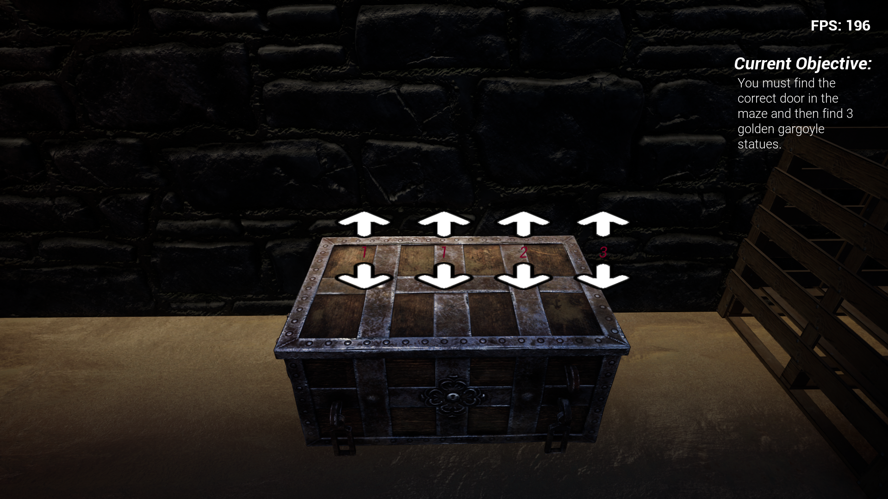

# Introduction
It is a first-person game, working title "Project Dungeon".
The game is developed on Unreal Engine 5.
In the game you play a character who was kidnapped after an attack on his village, your task is to get out of the kidnappers' hideout, but it will not be easy because various puzzles and easier as well as more difficult ones await you there. But that's not all, in a later stage you will meet kidnappers who will want to get rid of you. 

## About game
You start the game in a minimalist menu where you have several options such as "how to play"

***
- *Objectives*

- *Written riddles*

- *Picklock*

- *Entering the correct code to open e.g. chests*

- *And many more*

## Install
Open zip folder and unpack this, after that open StoryAboutJohn.exe

### Levels
The game contains 4 different lvl at each there are new obstacles as well as enemies

### Gameplay demo
https://youtu.be/ntbd3cBYMKQ
